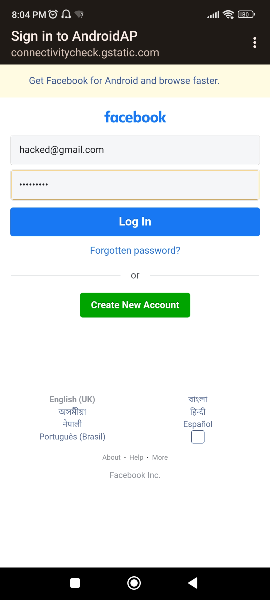
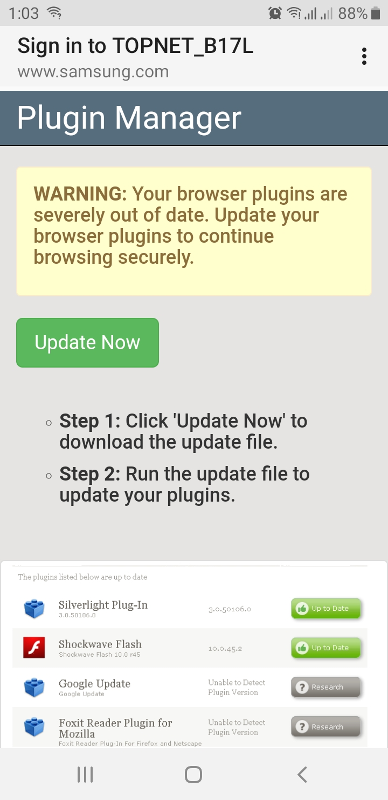
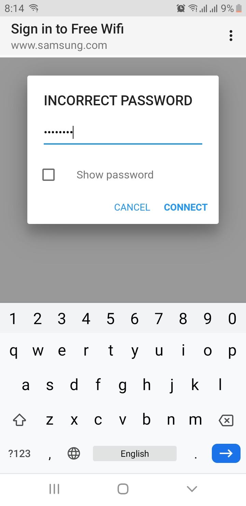

I made this basic script and tested it on Kali Nethunter. 
You don't need a second wireless interface or monitor mode. wlan0 is enough.  

**Note 1:**  
You need 3G/LTE connection button enabled, but you don't need to be connected to the internet. Even if your data plan is 0 megabytes, the attack works when you activate the mobile data 3G/LTE .  

**Note 2:**  
Sometimes you have to try again if the target doesn't change, restart the script, kill php process manually, turn the hotspot on/off or remove the directory from "/var/www/html/". 
# 1. **Scenario 1: facebook phishing**

# 2. **Scenario 2: fake plugin update with android APK**

    Create an android payload (update.apk).  
When the victim connects to the fake hotspot, he will get a splash screen asking him to download a necessary plugin update (update.apk)  
If he installs the apk, you'll get a meterpreter shell.  

# 3. **Scenario 3: Wifi Password Pop up**

In this scenario, you can name your hotspot the same name as any wifi network around you, and if the victim connects to it by mistake, he's greeted with a pop up login box that asks for the wifi password. 

You can access the logged credentials in the browser. 
**http://127.0.0.1:8080/logger.html**  

**Feel free to improve the script by modifying the code or providing other fake portals**
          
